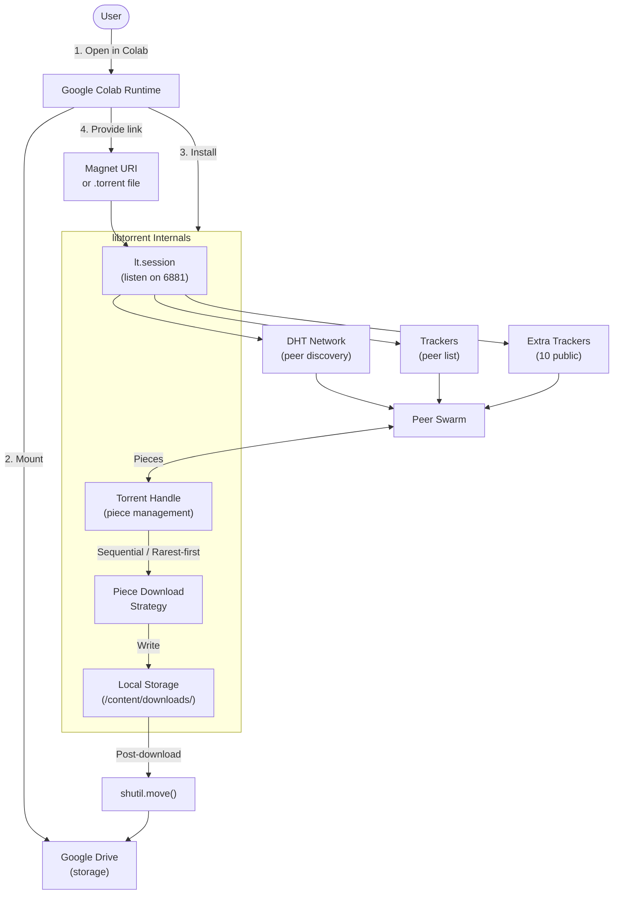
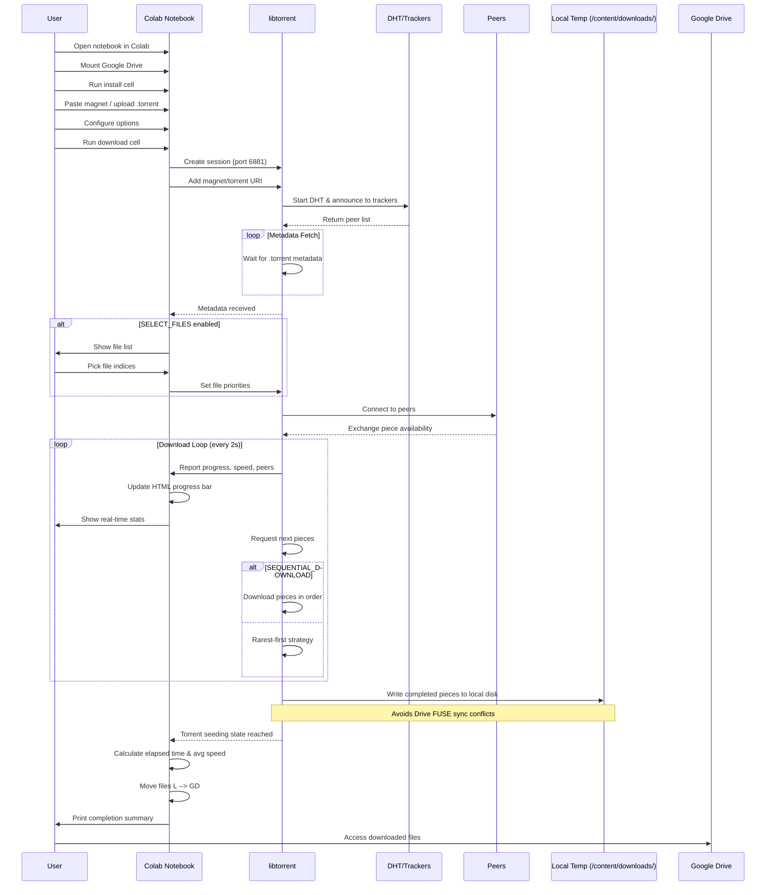
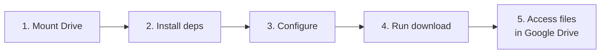
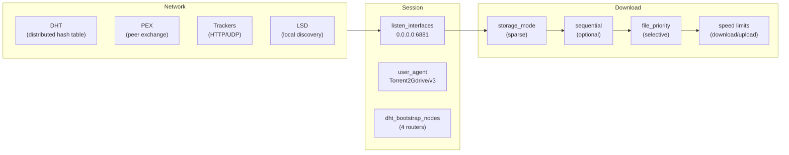

# Torrent To Google Drive Downloader

Download torrents and magnet links via Google Colab — downloads to a local temp dir first, then moves completed files to Drive to avoid sync conflicts.

---

## Architecture

---

## How It Works

---

## Features

| Feature | Description |
|---|---|
| **Sync-safe** | Downloads to local temp dir, moves to Drive after completion — no FUSE conflicts |
| **Magnet & Torrent** | Both magnet URIs and `.torrent` file uploads |
| **File Selection** | Pick specific files from multi-file torrents |
| **Sequential Download** | Download in order — start watching before it finishes |
| **Live Progress Bar** | HTML-based visual bar (`|#####...|`) with speed, peers, ETA |
| **Keep-Alive** | JS clicks the reconnect button every 2 min to prevent Colab timeout |
| **Resume Support** | Interrupted downloads auto-resume on re-run |
| **Speed Limits** | Throttle download/upload bandwidth |
| **Extra Trackers** | 10 public trackers added for better peer discovery |
| **Auto-Zip** | Automatically zips multi-file torrents; single files moved as-is for speed |
| **Sparse Storage** | Efficient partial-file allocation via libtorrent |
| **DHT / PEX / LSD** | Full peer discovery stack |

---

## How to Use

### One-Click Open in Colab

### Step-by-Step

1. **Mount Google Drive** — Run cell 1 to authenticate and mount
2. **Install Dependencies** — Run cell 2 (`libtorrent` via pip + `tqdm`)
3. **Configure** — Edit the config cell variables:

   | Variable | Type | Default | Description |
   |---|---|---|---|
   | `SAVE_PATH` | `str` | `/content/downloads/Torrent/` | Local temp dir (avoids Drive sync conflicts) |
   | `DRIVE_PATH` | `str` | `/content/drive/My Drive/Torrent/` | Final destination on Drive |
   | `MAGNET_LINK` | `str` | `""` | Magnet URI (or empty to upload `.torrent`) |
   | `SELECT_FILES` | `bool` | `False` | Prompt to choose files interactively |
   | `SEQUENTIAL_DOWNLOAD` | `bool` | `False` | Download pieces in file order |
   | `DOWNLOAD_SPEED_LIMIT` | `int` | `0` | Max download (B/s, 0 = ∞) |
   | `UPLOAD_SPEED_LIMIT` | `int` | `0` | Max upload (B/s, 0 = ∞) |
   | `MAX_CONNECTIONS` | `int` | `200` | Max peer connections |
    | `ZIP_PATH` | `str` | `""` | Zip output path (empty = auto-zip when 2+ files) |
   | `KEEP_ALIVE` | `bool` | `True` | Prevent Colab timeout during long downloads |
   | `EXTRA_TRACKERS` | `list` | 10 trackers | Extra UDP/HTTPS announce URLs |

4. **Run Download Cell** — Cell 4 begins the download with live progress bar
5. **Access Files** — Files appear in `DRIVE_PATH` inside Google Drive

---

## Technical Details

### Why Local First?

Google Drive's FUSE mount (`/content/drive`) cannot handle concurrent read/write from libtorrent while DriveFS is syncing. Writing directly to Drive causes:

- `FAILED_PRECONDITION: Stream was written to.`
- `badRequest` on upload requests
- Files moved to internal "Lost and Found"

**Solution**: Download to `/content/downloads/` (native ext4, no FUSE), then `shutil.move()` completed files to Drive. Since files are static at move time, DriveFS syncs cleanly.

### Keep-Alive

Colab disconnects idle sessions after ~90 minutes. The notebook injects JavaScript that clicks the `colab-connect-button` every 2 minutes, keeping the session alive for the full download.

### The BitTorrent Stack

### Key libtorrent API Calls

| Call | Purpose |
|---|---|
| `lt.session({settings_dict})` | Create session with modern settings dict |
| `lt.parse_magnet_uri(uri)` | Parse magnet link (replaces deprecated `add_magnet_uri`) |
| `ses.add_torrent(params)` | Add parsed magnet or `.torrent` to session |
| `handle.file_priority(i, 0)` | Skip a file (set priority to 0) |
| `handle.set_sequential_download(True)` | Enable sequential piece ordering |
| `ses.download_rate_limit(n)` | Cap download speed in bytes/sec |
| `handle.add_tracker({'url': u, 'tier': i})` | Add extra trackers post-metadata |
| `handle.force_reannounce()` | Re-announce to all trackers immediately |
| `handle.status().has_metadata` | Check if magnet metadata is available |
| `handle.status().name` | Get torrent name (replaces `handle.name()`) |
| `lt.storage_mode_t.storage_mode_sparse` | Allocate only written pieces on disk |

### What Changed From v2

| v2 (old) | v3 (current) | Why |
|---|---|---|
| `lt.session()` | `lt.session({...})` | The no-arg constructor was **removed** in libtorrent 1.2+ |
| `lt.add_magnet_uri()` | `lt.parse_magnet_uri()` + `ses.add_torrent()` | `add_magnet_uri` deprecated in libtorrent 2.0 |
| `handle.name()` | `handle.status().name` | `handle.name()` removed in 2.0 |
| `handle.has_metadata()` | `handle.status().has_metadata` | Same — property moved to status object |
| `start_dht()` | removed (auto-enabled) | DHT starts automatically in 2.0 |
| `add_dht_router(tuple)` | `dht_bootstrap_nodes` string setting | Router list is now a session setting |
| `ses.max_connections(n)` | `'connections_limit': n` | Moved to settings dict |
| `storage_mode_t(2)` | `storage_mode_t.storage_mode_sparse` | Magic number was fragile |
| `duplicate_is_error=True` | removed | Parameter **deprecated** in newer libtorrent |
| 6881-6891 hardcoded | Configurable via `listen_interfaces` | Fixed port range caused tracker blocks |
| `apt install python3-libtorrent` | `pip install libtorrent` | apt package is Python 3.10 only; pip supports 3.12 |
| Direct Drive download | Local temp → post-download `shutil.move()` | Avoids Drive FUSE sync conflicts |
| No keep-alive | JS `setInterval` clicks reconnect button | Prevents Colab timeout on long downloads |
| `tqdm` progress bar | `IPython.display.HTML` with `display_id` update | tqdm notebook widget doesn't flush during execution |
| Magnet only | Magnet + `.torrent` upload | Support plain torrent files |
| No file selection | `select_files()` with priority 0 | Save space by skipping files |
| No sequential | `set_sequential_download(True)` | Stream-before-complete |
| No speed limits | `download_rate_limit()` + `upload_rate_limit()` | Bandwidth control |
| No extra trackers | `add_extra_trackers()` with 10 public trackers | More peer discovery |
| No error handling | Try/except + metadata timeout | Graceful failure |

---

## Requirements

- **Google account** (for Colab & Drive)
- **Internet connection** (faster is better)
- **~20 GB free Drive space** for typical content

### Notes

- Google Colab sessions **time out after ~90 minutes** of inactivity. The keep-alive feature prevents this by simulating activity.
- Colab provides a single CPU core and ~12 GB RAM — sufficient for all but the most massive torrents.
- Download speeds vary from 1-50 MB/s depending on peer availability and Google's network.
- Zip behavior: auto-zips when 2+ files are downloaded. Set `ZIP_PATH` to always zip to a specific path. Single files skip zip (videos etc. don't benefit).

---

## Disclaimer

This project is intended for **legal use only** — downloading content you have the rights to (open source ISOs, public domain media, personal backups, etc.). Respect copyright laws in your jurisdiction.

---

## License

MIT
